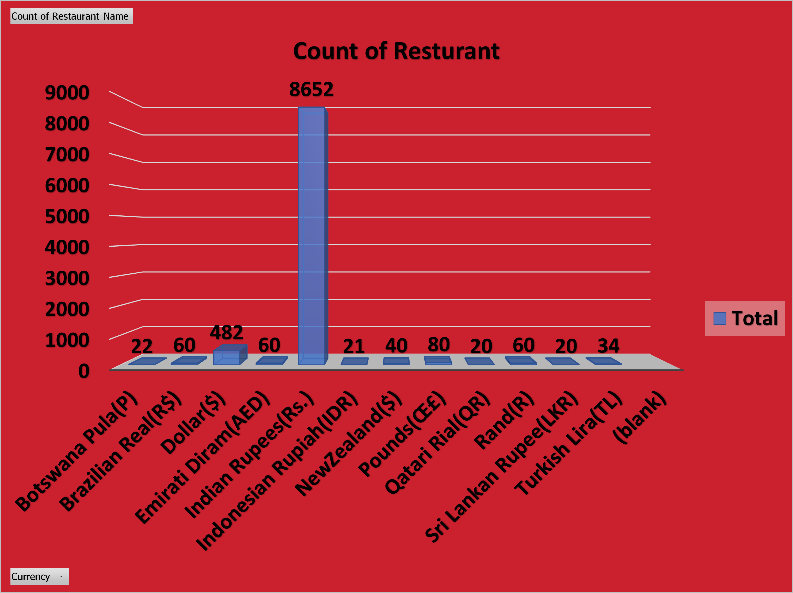
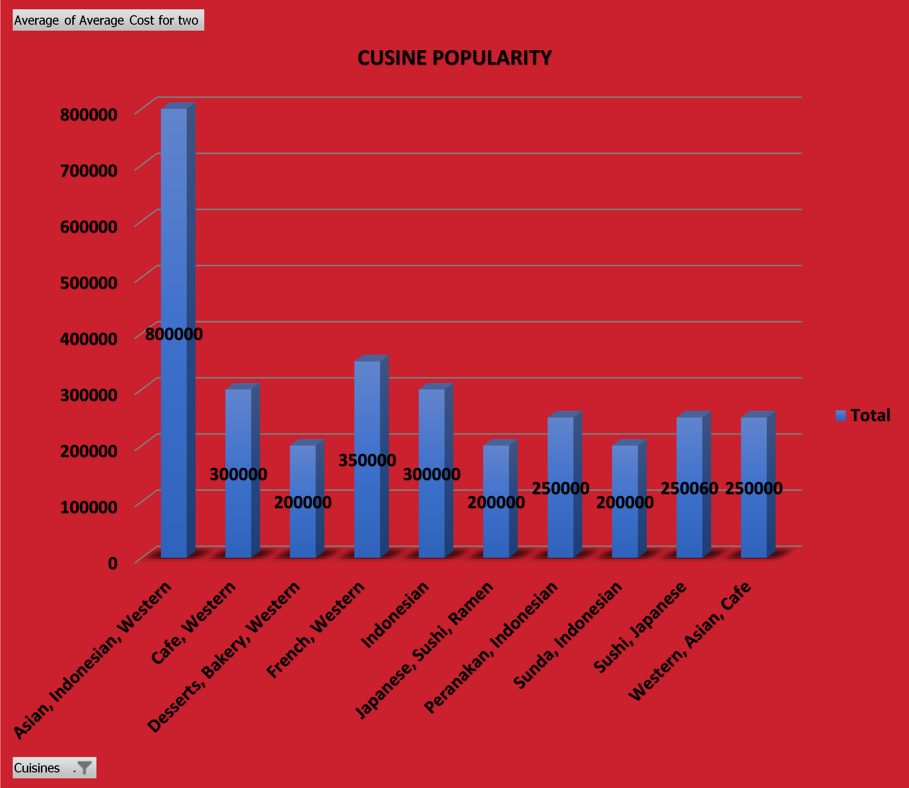
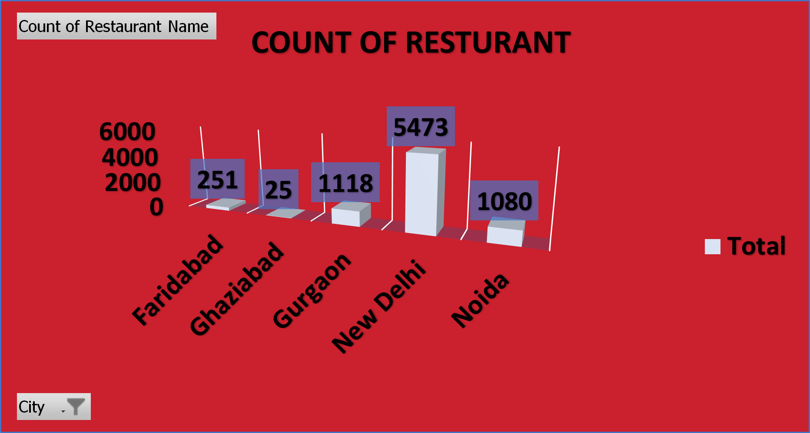
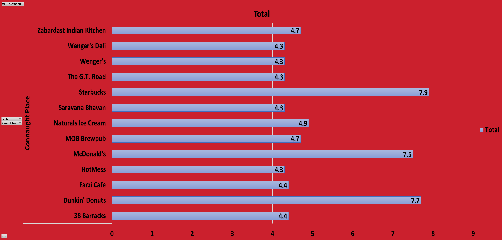

  

# Zomato Data Analysis 🍽️📊

## Project Overview

This project focuses on exploratory data analysis and visualization of
Zomato restaurant data to understand restaurant distribution, cuisine
popularity, customer preferences, and rating patterns across locations.

The analysis is performed using Microsoft Excel with pivot tables,
pivot charts, and interactive visuals to transform raw restaurant data
into meaningful business insights.

---

## Business Objectives

- Analyze restaurant distribution across cities and locations
- Identify popular cuisines and average cost patterns
- Understand rating trends by location and restaurant type
- Support data-driven decisions for market and customer analysis

---
## 📊 Zomato Dashboard Preview

---

### 🍽️ Count of Restaurants by Currency

- Indian Rupee (INR) dominates restaurant listings, showing India as the primary market.
- Other currencies have minimal presence, indicating limited global penetration.

---

### 🍜 Cuisine Popularity & Average Cost

- Western and Asian cuisines are the most popular across Zomato listings.
- Average cost varies significantly by cuisine, reflecting diverse customer segments.

---

### 🌍 City-wise Restaurant Distribution

- New Delhi has the highest number of restaurants on the platform.
- Gurgaon and Noida show strong secondary market presence.

---

### ⭐ Location-wise Rating Analysis

- Premium brands and established restaurants receive higher average ratings.
- Customer ratings vary by location, reflecting differences in service quality.

## Tools & Skills Used

- Microsoft Excel
- Data Cleaning
- Pivot Tables
- Pivot Charts
- Exploratory Data Analysis (EDA)
- Business Data Visualization

---

## Key Learnings

- Gained hands-on experience analyzing real-world food delivery data
- Improved ability to identify market trends and customer behavior
- Strengthened Excel dashboarding and data storytelling skills

---

## Author

Jyotirmaya Mishra
